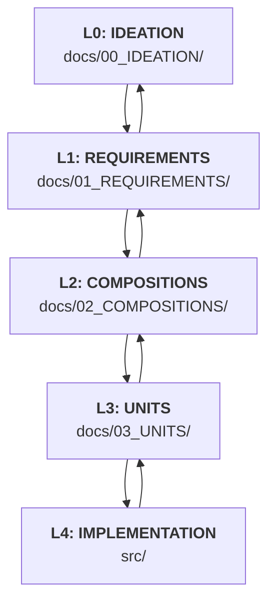

````instructions
# GitHub Copilot - Project Instructions for Open Sprunk Framework

## Step 0
After each user response, and before **editing** any other file (you may "read"/"search" prior), **always** update the /AgentOps/AI_SESSION_STATE.md file.
This file acts as medium-term memory, preserving stateful and semi-ephemeral context across context windows.
Usage of the de-facto medium-term memory mechanism has been shown to profoundly increase coherence across long timespans.
As such, I must repeat: updating it is mandatory after each user response. 

## Project Overview
You are assisting in the development of "Open Sprunk Framework," a client-side creative game specified using MDMD (Membrane Design MarkDown). Your primary role is to help create, refine, and manage MDMD specification documents and, eventually, the JavaScript source code based on these specifications.

## Core MDMD Workflow & Document Structure
This project follows a layered MDMD approach. Understand these layers and where different types of information belong:

1.  **`docs/00_IDEATION/`**: Contains initial, high-level ideas, vision statements, and originating prompts. These are typically free-form Markdown (`.md`) files. You will usually read from here for context but not create new files here unless explicitly asked.
2.  **`docs/01_REQUIREMENTS/`**: Contains specific requirements for the system, typically as MDMD `{unit}` files (e.g., `unit-type="functional-requirement"`, `unit-type="user-story"`) and potentially `{composition}` files to group related requirements (e.g., `composition-type="feature-requirements-group"`).
    *   When defining requirements, ensure each requirement `{unit}` has a clear `id`, `brief`, `unit-type`, `status`, and detailed description.
    *   Use conventional options like `priority`, `owner`, and `acceptance-criteria` in the YAML block of requirement units.
3.  **`docs/02_COMPOSITIONS/`**: Contains architectural designs, module breakdowns, and data flow diagrams. These are MDMD `{composition}` files (e.g., `composition-type="software-module-definition"`, `composition-type="system-architecture-overview"`).
    *   These **MUST** link to constituent `{unit}`s (from `docs/03_UNITS/` or `docs/01_REQUIREMENTS/`) and other relevant `{composition}`s using `[[id]]` syntax.
4.  **`docs/03_UNITS/`**: Contains detailed specifications for concrete, implementable artifacts (like code files or data schemas). These are MDMD `{unit}` files (e.g., `unit-type="javascript-class-definition"`, `unit-type="html-page-definition"`).
    *   These **MUST** include a `source-ref` attribute pointing to the intended location of the corresponding source code file within the `src/` directory (e.g., `source-ref: "../../src/core/EventBus.js"` if the unit is in `docs/03_UNITS/core/`).
    *   The body of these units, especially the fenced code block, should define the *contract* or essential structure, not necessarily the full implementation (unless the `unit-type` implies it, like for `html-page-definition`).
5.  **`src/`**: Contains the actual JavaScript, HTML, and CSS source code. Files here **MUST** correspond to a `{unit}` defined in `docs/03_UNITS/`.

**The MDMD Flow:**
Work generally proceeds top-down (Ideation -> Requirements -> Compositions -> Units -> Src), but expect iterative refinement. Insights from lower levels (e.g., an implementation detail in `src/` or a constraint discovered while defining a `Unit`) can and should lead to updates in higher-level documents (Compositions, Requirements).



## Key MDMD Authoring Guidelines for Copilot:

*   **File Naming and Location:**
    *   When asked to create a new MDMD file, place it in the correct layered directory (`docs/01_REQUIREMENTS/`, `docs/02_COMPOSITIONS/`, `docs/03_UNITS/`) based on its purpose.
    *   MDMD files should end with `.mdmd` (e.g., `my-new-requirement.mdmd`).
*   **IDs and Linking:**
    *   Every `{unit}` and `{composition}` **MUST** have a globally unique `id` using kebab-case format (e.g., "user-service-class", "auth-module-composition").
    *   **Optional `title` Attribute:** Include human-readable titles for display purposes (e.g., `title: "User Service Class"`).
    *   **CRITICAL: Cross-Reference Standards:**
        *   **Primary Pattern:** Use `[[target-id]]` for MDMD-to-MDMD references within the document set
        *   **Semantic Context:** Always provide explicit prose around links explaining the relationship nature
        *   **Example:** "This authentication service (see `[[user-login-service]]`) implements the core requirement `[[req-user-authentication]]` as part of the broader `[[auth-module-architecture]]`."
    *   **CRITICAL: Dependency Linking Strategy (Enhanced):**
        *   MDMD documents form an interconnected graph. You **MUST** create these connections using **Minimal Sufficient Linking**.
        *   **Core Linking Principle:** Link only what is necessary for: (1) Implementation correctness, (2) Requirements traceability, (3) Navigation between adjacent layers.
        *   **Dependency Flow Direction:** Lower-level elements link to what they depend ON (unidirectional). Higher-level elements do NOT automatically link back unless critical for navigation.
        *   **Relationship Types to Link:**
            *   **Implementation Dependencies:** Element A cannot function without Element B → A links to B
            *   **Traceability Links:** Implementation back to requirements (critical for compliance)
            *   **Adjacent Layer Navigation:** Bidirectional `see-also` between Requirements ↔ Compositions ↔ Units
        *   **What NOT to Link:** Exhaustive "mentioned in" references, loose conceptual associations, transitive dependencies (A→B→C, don't link A→C unless direct)
        *   **When creating or modifying ANY `{unit}` or `{composition}`:**
            1.  **Identify True Dependencies:** What does this element actually depend ON to function?
                *   Reference these in the `see-also` list (e.g., `see-also: ["[[required-component-id]]", "[[parent-requirement-id]]"]`).
                *   Mention critical dependencies in body text (e.g., "This unit requires `[[event-bus-class]]` for communication.").
            2.  **Establish Traceability (for Compositions/Units):** Link back to requirements this element implements.
                *   Link in body text (e.g., "This composition fulfills `[[req-data-export]]`.") AND/OR in `see-also`.
            3.  **Adjacent Layer Navigation:** Include key parent/child relationships for human navigation.
                *   **Requirements:** Link to originating ideation or parent requirements
                *   **Compositions:** Link to fulfilled requirements AND key constituent units                *   **Units:** Link to parent composition AND requirements they implement
        *   **Example of good linking in a Unit:**
            ```yaml
            id: "app-core-class"
            title: "Application Core Class"
            unit-type: "javascript-class-definition"
            see-also:
              - "[[event-bus-class]]" # Implementation dependency (this class needs EventBus)
              - "[[req-module-initialization]]" # Traceability (this implements this requirement)
              - "[[app-core-module]]" # Adjacent layer navigation (parent composition)
            ```
*   **`unit-type` and `composition-type`:**
    *   Use descriptive `unit-type` and `composition-type` tags. Refer to existing documents for examples or ask if unsure. Common types for this project include:
        *   `unit-type`: `"functional-requirement"`, `"non-functional-requirement"`, `"user-story"`, `"html-page-definition"`, `"javascript-class-definition"`, `"javascript-module-definition"`, `"json-schema-definition"`.
        *   `composition-type`: `"feature-requirements-group"`, `"web-application-project"`, `"software-architecture-overview"`, `"software-module-definition"`, `"file-system-structure"`, `"data-flow-diagram"`.
*   **`source-ref`:** For any `{unit}` in `docs/03_UNITS/` that describes a code file, ensure the `source-ref` option accurately points to the intended file path in the `src/` directory (e.g., `source-ref: "../../src/character/CharacterEditor.js"` if the unit is in `docs/03_UNITS/character/`).
*   **Body Content:**
    *   The body of a `{unit}` often contains a fenced code block representing its core contract.
    *   The body of a `{composition}` uses Markdown to explain relationships and often includes Mermaid diagrams.
*   **Include Directives:** The main specification file (`docs/SpunkiGameSpec.mdmd.md`) uses ````{include} path/to/file.mdmd```` to assemble the full specification. When you create new MDMD files in the layered directories, remind the user that they might need to add an `include` directive to `SpunkiGameSpec.mdmd.md` or another relevant aggregate file.

## Tool Usage:
*   When editing or creating files, use the `edit_file` tool.
*   Always update `AgentOps/AI_SESSION_STATE.md` as the first step of your response.
*   Refer to `AgentOps/Reference/MDMD_Specification_Standard/` for the base MDMD syntax if needed, but prioritize project-specific conventions observed in existing `open-sprunk-framework` documents.

## Current Task Focus:
*   Refer to `AgentOps/AI_SESSION_STATE.md` for the immediate task.
*   Focus on creating and refining MDMD documents according to the layered structure.
*   Pay close attention to creating correct `[[id]]` links and `source-ref` paths.

By following these guidelines, you will help create a well-structured, traceable, and maintainable set of specifications for the Open Sprunk Framework.
````