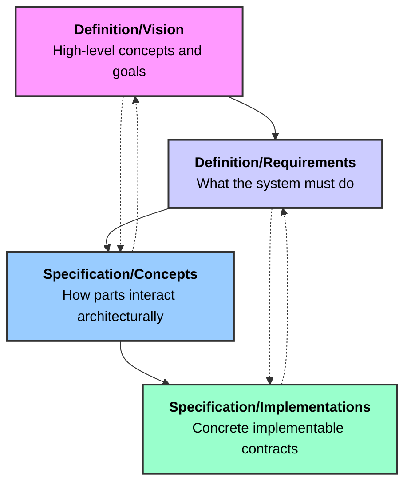
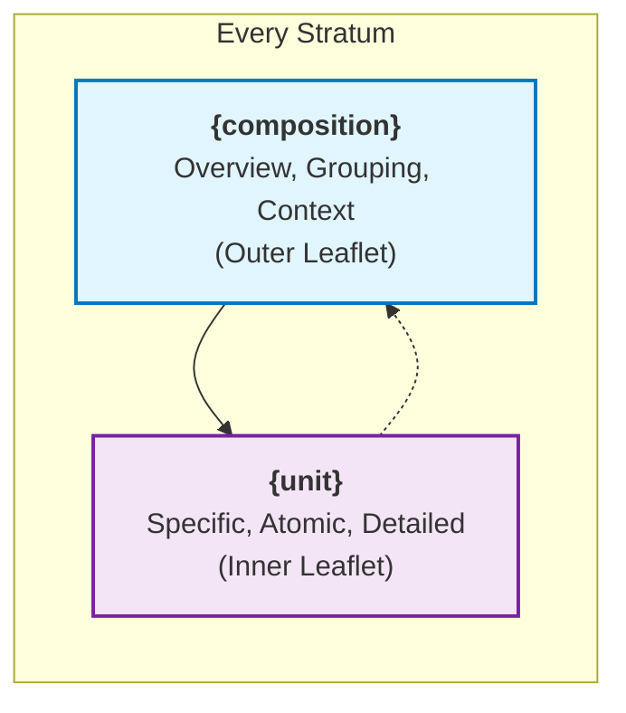

# MDMD (Membrane Design MarkDown) Specification v0.1

## 1. Abstract

MDMD (Membrane Design MarkDown) is a system for specifying complex solutions. It utilizes MyST Markdown extended with two core directives: `{unit}` and `{composition}`. MDMD facilitates a layered approach to design, moving from concrete, implementable details to higher-level conceptual architectures. It is designed for collaborative creation by humans and AI, aiming for clarity, traceability, and the potential for bi-directional synchronization between specifications and their real-world implementations (e.g., source code, configuration files, physical designs).

## 2. Core Architecture: The Recursive Bilayer/Strata Model

MDMD implements a revolutionary recursive bilayer architecture where "bilayers exist all the way down" - each stratum (conceptual layer) contains its own bilayer of definitions and specifications. This creates a fractal-like structure that scales from high-level vision to concrete implementation details.

### 2.1. The Strata Organization

MDMD organizes content into semantic strata that represent different levels of abstraction and specificity:



#### Definition Stratum: "What" Layer
- **Vision**: High-level ideas, goals, and originating concepts
- **Requirements**: Formal specifications of what the system must accomplish
- **Characteristics**: Declarative, specification-focused, defines constraints and goals

#### Specification Stratum: "How" Layer  
- **Concepts**: Architectural designs showing how requirements are fulfilled
- **Implementations**: Concrete contracts for implementable artifacts
- **Characteristics**: Procedural, implementation-focused, defines structure and behavior

### 2.2. Recursive Bilayer Within Each Stratum

Each stratum contains its own bilayer of `{composition}` (overview/grouping) and `{unit}` (specific/atomic) elements:



**Examples by Stratum:**

- **Definition/Vision**: 
  - `{composition}`: Project vision overview, goal frameworks
  - `{unit}`: Specific vision statements, individual goals
- **Definition/Requirements**:
  - `{composition}`: Feature requirement groups, user story maps  
  - `{unit}`: Individual functional requirements, specific user stories
- **Specification/Concepts**:
  - `{composition}`: System architectures, module designs
  - `{unit}`: Interface definitions, data flow specifications
- **Specification/Implementations**:
  - `{composition}`: Module implementation overviews
  - `{unit}`: Class definitions, file specifications

### 2.3. Inter-Stratum Linkage Patterns

The recursive bilayer model enables sophisticated cross-stratum relationships:

#### Primary Linkage Flow (Dependency Direction)
- **Downward Flow**: Higher strata define constraints for lower strata
- **Upward Flow**: Lower strata provide implementation details for higher strata
- **Horizontal Flow**: Elements within same stratum reference peers and constituents

#### Cross-Stratum Reference Patterns
```markdown
# Definition/Requirements → Specification/Concepts
"This architecture `[[auth-module-architecture]]` fulfills requirement `[[req-user-authentication]]`."

# Specification/Concepts → Definition/Requirements  
"This module implements requirements `[[req-user-login]]` and `[[req-password-security]]`."

# Specification/Implementations → Specification/Concepts
"This class `[[user-service-class]]` belongs to the `[[auth-module-architecture]]`."
```

## 3. Core Primitives (The Bilayer Implementation)

Within each stratum, MDMD defines two primary structural directives, forming the conceptual "bilayer":

### 3.1. The `{unit}` Directive

- **Purpose:** Represents a fundamental, discrete, and specifiable building block of a system. It defines the _contract_ or _declaration_ of an atomic part. This is the "Inner Leaflet" of the MDMD bilayer, interfacing closely with concrete implementation details.
- **Syntax:**

  ```myst
  ::: {unit}
  id: "unique-identifier-in-kebab-case"
  title: "Human Readable Title"
  unit-type: "string-tag-describing-the-unit-kind"
  language: "relevant-language-of-content-block"
  status: "idea | draft | review | stable | deprecated"
  version: "string-version-identifier"
  brief: "One-line concise summary of the unit's purpose."
  source-ref: "./path/to/linked/source/file.ext"
  see-also: ["[[other-id]]", "../another-doc.md#section"]

  (Optional) Free-form Markdown text providing human-readable explanations,
  context, rationale, examples, or specific notes for AI interpretation
  regarding the content block. This section can use any standard MyST Markdown
  features, including lists, admonitions, and links to other `{unit}`s
  or `{composition}`s (e.g., `[[target-id]]`).

  \`\`\`[language-identifier-from-option-or-specific-to-content]
  // The core formal definition or content of the unit.
  // Examples: API signatures, data structure definitions, configuration snippets,
  // textual requirements, material specifications, ingredient lists.
  // The interpretation of this block is heavily guided by the `unit-type`
  // and `language` options.
  \`\`\`

  (Optional) Further Markdown explanation or examples.
  :::
  ```

- **Key Option Interpretation:**
  - `id` (String, Required): Globally unique identifier using kebab-case format (e.g., "user-service-class", "auth-module-composition"). Primary target for `[[id]]` links.
  - `title` (String, Optional): Human-readable display title (e.g., "User Service Class", "Authentication Module Composition"). Used for navigation and documentation display.
  - `unit-type` (String, Required, Open Tag): **Crucial semantic hint.** Guides interpretation of the content block. Examples: `c-function-signature`, `csharp-class-interface`, `python-module-api`, `yaml-k8s-deployment`, `json-schema-definition`, `architectural-principle`, `user-requirement`. (This list is exemplary, not exhaustive; the system is open to new `unit-type` tags.)
  - `language` (String, Optional): The primary language of the main content block (e.g., "csharp", "python", "yaml", "json", "markdown", "natural-english").
  - `source-ref` (String, Optional, Path): A link to an external source file this unit describes or is derived from. Essential for bi-directional synchronization tasks.
- **Body Content Interpretation:** The fenced code block (or primary content block if `language` is `markdown` or `natural-english`) contains the formal definition. Surrounding Markdown provides context.

### 3.2. The `{composition}` Directive

- **Purpose:** Represents how `{unit}`s and/or other `{composition}`s are assembled, interact, or are conceptually grouped. It describes larger system parts, architectures, processes, or conceptual frameworks. This is the "Outer Leaflet" of the MDMD bilayer, focused on relationships and higher-level understanding.
- **Syntax:**

  ```myst
  ::: {composition}
  id: "unique-identifier-in-kebab-case"
  title: "Human Readable Title"
  composition-type: "string-tag-describing-the-composition-kind"
  status: "idea | draft | review | stable | deprecated"
  version: "string-version-identifier"
  brief: "One-line concise summary of the composition's purpose."
  see-also: ["[[other-id]]", "../another-doc.md#section"]

  Rich Markdown content forms the body. This typically includes:
  - Prose explanations of purpose, design, rationale.
  - **Explicit `[[id]]` links** to constituent `{unit}`s and sub-`{composition}`s, forming a navigable graph.
  - Embedded diagrams (e.g., MermaidJS: `sequenceDiagram`, `graph TD`, `classDiagram`, `stateDiagram`, `erDiagram`) illustrating structures and interactions. `Ref: [[id]]` annotations within diagram elements are encouraged for linking.
  - Lists of principles, requirements, or interaction steps.
  :::
  ```

- **Key Option Interpretation:**
  - `id` (String, Required): Globally unique identifier using kebab-case format (e.g., "auth-module-architecture", "sprunki-core-system"). Primary target for `[[id]]` links.
  - `title` (String, Optional): Human-readable display title (e.g., "Authentication Module Architecture", "Sprunki Core System"). Used for navigation and documentation display.
  - `composition-type` (String, Required, Open Tag): **Crucial semantic hint.** Guides interpretation of the content. Examples: `logical-software-module`, `system-data-flow-diagram`, `api-usage-scenario`, `deployment-architecture-overview`, `user-story-map`, `project-phase-definition`. (Exemplary, not exhaustive.)
- **Body Content Interpretation:** The body is free-form MyST Markdown. Its primary purpose is to describe the assembly and interaction of its referenced components. Diagrams and explicit `[[id]]` links are key structural elements.

## 4. Core Principles for MDMD Interpretation & Generation

### 4.1. ID Conventions and Cross-Reference Standards

MDMD employs standardized conventions for identifiers and cross-references to ensure maintainability and tool compatibility:

#### ID Naming Convention
- **Format:** All `id` attributes MUST use kebab-case (lowercase with hyphens)
- **Examples:** `user-service-class`, `auth-module-composition`, `data-export-requirement`
- **Rationale:** Consistent, machine-friendly format that works across tooling ecosystems
- **Human Readability:** Use optional `title` attribute for display purposes

#### Cross-Reference Linking Strategy
- **Primary Pattern:** Use `[[target-id]]` for MDMD-to-MDMD references within the same document set
- **Path-based Linking:** Use `../relative/path.mdmd#section` only for external document references
- **Semantic Context:** Always provide explicit prose around links explaining the relationship nature
- **Example:**
  ```markdown
  This authentication service (see `[[user-login-service]]`) implements the core requirement `[[req-user-authentication]]` as part of the broader `[[auth-module-architecture]]`.
  ```

#### Relationship Semantics in Prose
- **Implementation Dependencies:** "This class requires `[[event-bus-class]]` for message coordination."
- **Architectural Associations:** "This unit belongs to the `[[data-manager-module]]` composition."
- **Traceability Links:** "This implementation addresses requirement `[[req-data-persistence]]`."
- **Avoid Bare Links:** Always contextualize links with explanatory prose

### 4.2. MDMD Standards vs. MyST Integration

MDMD maintains compatibility with MyST Markdown while establishing domain-specific conventions:

#### YAML Frontmatter Location
- **MDMD Standard:** YAML options remain within directive blocks (not document-level frontmatter)
- **Rationale:** Allows multiple units/compositions per file and maintains MyST compatibility
- **Example:**
  ```myst
  ::: {unit}
  id: "user-service-class"
  title: "User Service Class"
  unit-type: "javascript-class-definition"
  
  Content here...
  :::
  ```

#### MyST Compatibility Features
- **Directive Support:** Full MyST directive ecosystem remains available
- **Cross-Reference Extensions:** Consider MyST-parser extensions for enhanced `[[id]]` linking
- **Rendering Pipeline:** MDMD documents can be processed through standard MyST toolchains

### 4.3. Core Interpretation Principles

- **Primacy of `*-type` Attributes:** `unit-type` and `composition-type` are the strongest signals for understanding the nature and expected content of a directive.
- **Content Blocks are Ground Truth for Contracts:** In `{unit}`s defining implementable artifacts, the fenced code block is the primary source of the formal contract.
- **Markdown Body for Context and Nuance:** Use the surrounding Markdown within directives to provide essential explanations, rationale, examples, and any specific guidance for processing or interpretation.
- **Links (`[[id]]`) Create the System Graph:** All `[[id]]` references should be resolvable to other `{unit}` or `{composition}` directives within the specification set. These links define the system's structure and dependencies.
- **Diagrams Enhance Understanding:** MermaidJS (or other MyST-compatible diagrams) within `{composition}`s should visually represent the relationships between linked elements, ideally using `Ref: [[id]]` annotations.
- **Open Vocabulary for `*-type`:** While conventions for common `unit-type` and `composition-type` values will emerge and should be preferred for consistency, the system allows for new, descriptive tags as needed by the domain being specified.
- **Bi-Directional Intent:**
  - **MDMD-to-Implementation:** `{unit}` directives, especially those with code blocks and relevant `unit-type`s, can serve as precise specifications for generating code stubs, configuration files, or other artifacts. `{composition}` directives provide context for how these units should be integrated.
  - **Implementation-to-MDMD:** Existing code, configurations, or other artifacts can be analyzed to generate corresponding MDMD `{unit}` directives. Relationships and interactions can be summarized into `{composition}` directives. The `source-ref` in a `{unit}` is critical for this linkage.

## 4.4. The MDMD Layered Design Workflow & Traceability

MDMD supports a progressive workflow organized into semantic strata that replace traditional numbered layers. The strata (Definition/Vision, Definition/Requirements, Specification/Concepts, Specification/Implementations) help organize the specification process while maintaining the recursive bilayer model within each stratum. **Crucially, MDMD emphasizes explicit linking between these strata to ensure traceability.**

```mermaid
graph TD
    A["<strong>Definition/Vision</strong><br/>(Free-form Concepts, Vision)<br/>e.g., Idea.md"] --> B;
    B["<strong>Definition/Requirements</strong><br/>(What the system must do)<br/>`{unit unit-type="functional-requirement"}`<br/>`{composition composition-type="feature-requirements"}`"] --> C;
    C["<strong>Specification/Concepts</strong><br/>(How parts group & interact to meet Requirements)<br/>`{composition composition-type="system-architecture"}`"] --> D;
    D["<strong>Specification/Implementations</strong><br/>(Specific parts implementing Concepts)<br/>`{unit unit-type="javascript-class"}`"] --> E;
    E["<strong>L4: IMPLEMENTATION</strong><br/>(Source Code Files)<br/>e.g., .js, .html"] --> F;
    F["<strong>L5: REALITY</strong><br/>(Deployed System)"];

    %% Feedback Loops & Traceability Arrows (showing dependency direction)
    B -- "derived from" --> A; // Requirements are derived from Vision
    C -- "satisfies" --> B;   // Concepts satisfy Requirements
    D -- "realizes" --> C;    // Implementations realize parts of Concepts
    E -- "implements" --> D;  // Code implements Implementation Units
    
    F -.-> E; E -.-> D; D -.-> C; C -.-> B; B -.-> A; // Feedback
    
    style A fill:#f9f,stroke:#333,stroke-width:2px,color:#000
    style B fill:#ccf,stroke:#333,stroke-width:2px,color:#000
    style C fill:#9cf,stroke:#333,stroke-width:2px,color:#000
    style D fill:#9fc,stroke:#333,stroke-width:2px,color:#000
    style E fill:#ff9,stroke:#333,stroke-width:2px,color:#000
    style F fill:#f66,stroke:#333,stroke-width:2px,color:#000
```

*   **Definition/Vision:** Captures the initial vision, goals, and high-level concepts. Often realized as plain Markdown documents or external references.
*   **Definition/Requirements (`{unit unit-type="functional-requirement"}` etc.):**
    *   Defines *what* the system must do.
    *   Individual requirements (functional, non-functional, user stories, etc.) are typically specified as **`{unit}`** directives with appropriate `unit-type` values.
    *   **Body/`see-also` MUST** reference relevant Vision elements (if any, e.g., `[[project-vision-statement]]` or external links).
    *   Can link to other related requirements (parent/child, dependent).
    *   Groups of related requirements or feature definitions can be specified as **`{composition}`** directives (e.g., `composition-type="feature-requirements"`), linking to their constituent requirement `{unit}`s.
*   **Specification/Concepts (Architectural Design):**
    *   Describes *how* the system is structured and how its major parts interact.
    *   Primarily uses **`{composition}`** directives (e.g., `composition-type="system-architecture"`, `composition-type="software-module"`).
    *   **Body/`see-also` MUST** explicitly list the Requirement `{unit}`(s) they are designed to satisfy (e.g., "This module fulfills requirements: `[[req-user-login]]`, `[[req-data-encryption]]`.").
    *   **Body/`see-also` MUST** link to the constituent `{unit}`s (from Specification/Implementations) or sub-`{composition}`s that form this architectural component.
*   **Specification/Implementations (Concrete Contracts):**
    *   Specifies the precise contracts of individual, implementable software artifacts or other concrete elements.
    *   Primarily uses **`{unit}`** directives (e.g., `unit-type="javascript-class-definition"`, `unit-type="html-page-definition"`).
    *   **Body/`see-also` MUST** link to the Requirement `{unit}`(s) they directly help implement or satisfy.
    *   **Body/`see-also` SHOULD** link to the parent Architectural `{composition}`(s) they belong to.
    *   **MUST** have a `source-ref` to the actual implementation file.
*   **L4: Implementation:** The actual source code, configuration files, etc. These are referenced by Specification/Implementation units via `source-ref`.
*   **L5: Reality:** The deployed, running system. Feedback from this layer can inform refinements at any higher stratum.

This flow is iterative. Discoveries or constraints at lower strata (e.g., implementation challenges) can and should feed back to influence and refine higher strata (e.g., requirements or architectural design).

### 4.5. Explicit Dependency Linking (Reinforced)

The `[[id]]` links are the primary mechanism for establishing these dependencies. The `see-also` attribute serves as a structured list for these links. The narrative body of a directive should also explain these relationships.

**Example of Dependency Flow:**

1.  A `{unit id="req-user-authentication" unit-type="functional-requirement"}` is defined.
2.  A `{composition id="auth-module-architecture" composition-type="software-module"}` states in its body: "This module implements `[[req-user-authentication]]`." and includes links to `[[user-model-unit]]`, `[[password-hasher-unit]]`.
3.  A `{unit id="user-login-service-unit" unit-type="javascript-class-definition" source-ref="..."}` states in its `see-also`: `["[[req-user-authentication]]", "[[auth-module-architecture]]"]`.

This explicit, bi-directional (or at least multi-directional) linking is what enables impact analysis and ensures specifications remain coherent. An LLM, when asked to modify a requirement, should be prompted to identify and review all downstream linked concepts and implementation units. Conversely, a change in a low-level implementation unit should prompt verification against its linked requirements.

### 4.6. Dependency Direction Guidelines

MDMD employs a strategic approach to linking that balances navigation needs with maintenance efficiency:

#### Primary Principle: Dependency Flow (Unidirectional)
- **Units** link to what they depend ON (other units, external dependencies)
- **Compositions** link to their constituent units and fulfilled requirements  
- **Requirements** link to their originating ideation or parent requirements
- **Direction:** Lower-level elements → Higher-level elements they depend on

#### Secondary Principle: Layer Navigation (Bidirectional)
- Adjacent layers maintain bidirectional `see-also` links for human navigation
- **Example:** Requirements ↔ Compositions, Compositions ↔ Units
- **Purpose:** Enables both "what implements this?" and "what does this implement?" queries

#### Anti-Pattern: Circular Dependencies
- Higher-level documents should NOT link to every element that implements them
- **Example:** A requirement should NOT link to every unit that implements it
- **Rationale:** Creates maintenance burden without implementation value
- **Exception:** Strategic "key implementation" links for critical traceability

### 4.7. Relationship Types and Linking Strategy

MDMD distinguishes between different types of relationships to guide appropriate linking:

#### Implementation Dependencies (`depends-on`)
- **Definition:** Element A cannot function without Element B
- **Usage:** Link in `see-also` or body text with `[[id]]`
- **Examples:** 
  - A JavaScript class depends on an EventBus class
  - An HTML page depends on specific CSS/JS files
  - A composition requires specific requirements to be fulfilled
- **Linking Pattern:** A → B (A links to B, B does NOT automatically link back)

#### Architectural Associations (`part-of`)
- **Definition:** Element A is a component of Element B  
- **Usage:** Link from component to parent in `see-also`, parent may link to key components in body
- **Examples:**
  - A unit is part of a module composition
  - A module is part of the overall architecture
- **Linking Pattern:** Component → Parent (with selective Parent → Key Components)

#### Traceability Links (`implements` / `addresses`)
- **Definition:** Element A fulfills or addresses Element B
- **Usage:** Link from implementations back to requirements in `see-also`
- **Examples:**
  - A composition addresses specific requirements
  - A unit implements functionality specified in a requirement
- **Linking Pattern:** Implementation → Requirement (critical for compliance tracking)

### 4.8. Minimal Sufficient Linking

To maintain clarity and reduce maintenance overhead, MDMD follows a "Minimal Sufficient Linking" approach:

#### Core Principle
Link only what is necessary for:
1. **Implementation correctness** (true dependencies)
2. **Requirements traceability** (for compliance/testing)  
3. **Navigation between adjacent layers** (for human usability)

#### What TO Link
- **True dependencies:** Elements that must exist for functionality
- **Requirements traceability:** Clear path from implementation back to requirements
- **Adjacent layer navigation:** Parent compositions, child units
- **Critical architectural relationships:** Key structural dependencies

#### What NOT to Link
- **Exhaustive "mentioned in" references:** Don't link every casual mention
- **Symmetric associations without dependency:** Avoid A↔B unless both directions add value
- **Transitive dependencies:** If A→B→C, don't link A→C unless direct dependency exists
- **Loose conceptual associations:** Focus on implementation needs, not abstract relationships

#### Maintenance Rules
- **Responsibility:** When updating a document, verify only its outgoing links
- **Incoming links:** Are the responsibility of the referencing document
- **Discovery:** Use `grep` or semantic search to find incoming references when needed
- **Validation:** Periodically validate that `[[id]]` references resolve correctly

### 4.9. Audience-Specific Usage Patterns

MDMD supports both AI assistants and human contributors with different navigation patterns:

#### For LLM Assistants
- **Follow dependency chains systematically:** Use unidirectional links to trace dependencies
- **Use semantic search:** When bidirectional links are missing, use semantic search to find related documents
- **Focus on implementation dependencies:** Prioritize links that affect functional correctness
- **Prefer inline `[[id]]` links:** Use links in body text over extensive `see-also` lists for context
- **Validate link integrity:** Check that referenced IDs exist and are reachable

#### For Human Contributors  
- **Use bidirectional layer navigation:** Rely on `see-also` between adjacent layers for exploration
- **Leverage directory structure:** Use file naming and folder organization for discovery
- **Focus on traceability links:** Use requirement→implementation links for validation
- **Use IDE search features:** Employ "find references" and global search to discover relationships
- **Visual diagrams:** Rely on Mermaid diagrams in compositions for architectural understanding

#### Tooling Recommendations
- **Link validation scripts:** Automated checking of `[[id]]` reference integrity
- **Dependency visualization:** Tools to generate dependency graphs from MDMD links
- **Bidirectional navigation aids:** IDE extensions or tools to find "what links to this?"
- **Semantic search integration:** AI-powered search across MDMD documents for conceptual relationships

## 5. Example Task: Generating a C# Class Stub from an MDMD `{unit}`

Given an MDMD `{unit}`:

```myst
::: {unit}
id: "user-service-interface"
title: "User Service Interface"
unit-type: "csharp-interface-definition"
language: "csharp"
brief: "Defines the contract for user management operations."

This interface provides methods for creating, retrieving, and updating user data.

\`\`\`csharp
public interface IUserService
{
    Task<UserDto?> GetUserAsync(string userId);
    Task<UserDto> CreateUserAsync(CreateUserRequest request);
    Task<bool> UpdateUserAsync(string userId, UpdateUserRequest request);
}
\`\`\`
:::
```

The expected output would be a C# interface file. The properties of `UserDto`, `CreateUserRequest`, etc., would ideally be defined in their own linked `{unit}` directives with `unit-type="csharp-dto-definition"`.

## 6. Example Task: Generating an MDMD `{unit}` from a C Function Signature

Given a C function: `int process_data(const char* input, char* output, size_t max_len); // Processes input data and writes to output.`
An expected MDMD `{unit}` might be:

```myst
::: {unit}
id: "c-func-process-data"
title: "Process Data Function"
unit-type: "c-function-signature"
language: "c"
brief: "Processes input data and writes to an output buffer."
source-ref: "./src/data_processor.c#L52" // Example link to source

Processes the null-terminated `input` string and writes the result to the `output`
buffer, ensuring not to exceed `max_len`.

\`\`\`c
int process_data(const char* input, char* output, size_t max_len);
\`\`\`

**Parameters:**
*   `input` (const char*): The input data to process.
*   `output` (char*): The buffer to write processed data to.
*   `max_len` (size_t): The maximum number of bytes to write to `output`.
**Returns:**
*   (int): 0 on success, non-zero on error.
:::
```

This MDMD Specification Document provides the foundational rules for interpreting and generating MDMD content.