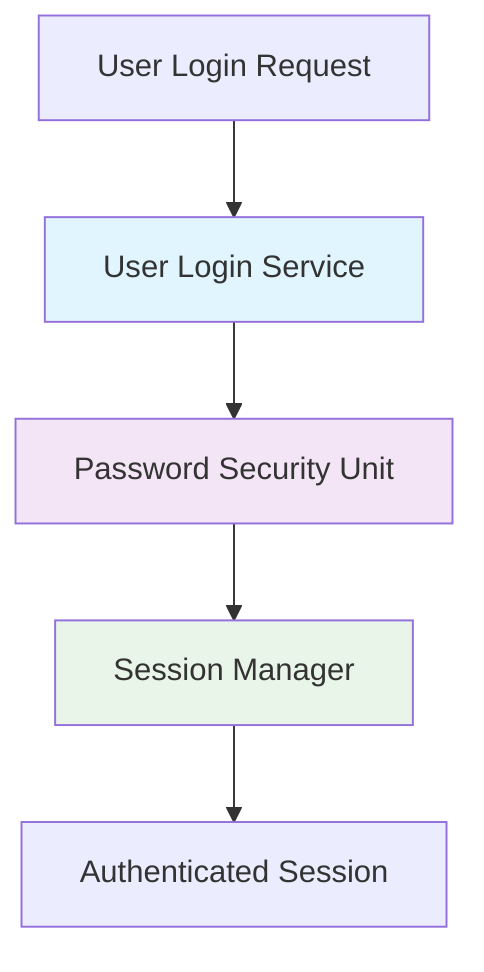

::: {composition}
id: "mdmd-primitive-composition-directive-spec"
title: "MDMD Composition Directive Specification"
composition-type: "language-primitive-specification"
status: "stable"
version: "0.2"
brief: "Specification for the MDMD '{composition}' directive supporting recursive bilayer/strata model."
see-also: ["[[mdmd-spec-main]]", "[[mdmd-concept-composition-intent]]", "[[mdmd-primitive-unit-directive-spec]]"]

This composition defines the MDMD `{composition}` directive within the recursive bilayer/strata
architecture. The `{composition}` directive describes how `{unit}`s and/or other `{composition}`s
are assembled, interact, or are conceptually grouped to form larger system parts.
It acts as the "Outer Leaflet" of each stratum's bilayer, providing overview, context, and
architectural understanding.

## 1. Purpose and Strata Context

The `{composition}` directive allows authors to structure narratives, define
architectural views, illustrate interactions, and group related specification
elements across different abstraction strata:

- **Definition/Vision Stratum**: Project vision overviews, goal frameworks
- **Definition/Requirements Stratum**: Feature requirement groups, user story maps
- **Specification/Concepts Stratum**: System architectures, module designs  
- **Specification/Implementations Stratum**: Module implementation overviews

The directive relies heavily on Markdown prose, embedded Mermaid diagrams, and explicit
`[[id]]` linking to other MDMD directives, creating navigable dependency graphs across strata.

Reference: [[mdmd-concept-composition-intent]]

## 2. MyST Directive Implementation Contract

This `{unit}` defines the contract for the `DirectiveSpec` object that our
MyST JavaScript plugin must export to implement the MDMD `{composition}` directive.

::: {unit}
id: "myst-directive-spec-for-mdmd-composition"
title: "MyST DirectiveSpec for MDMD Composition"
unit-type: "typescript-interface-definition"
language: "typescript"
brief: "The MyST DirectiveSpec contract for the MDMD {composition} directive with enhanced strata support."
source-ref: "src/directives/compositionDirective.ts" // Our target TS file

This `DirectiveSpec` from `myst-common` outlines the expected structure for
defining the `{composition}` directive within a MyST JavaScript plugin, supporting
the recursive bilayer/strata model with enhanced cross-reference patterns and semantic linking.

```typescript
import type { DirectiveSpec, DirectiveData, GenericNode } from 'myst-common';
import { mystParse } from 'myst-parser'; // To parse the body string
import { u } from 'unist-builder';

export const compositionDirectiveSpec: DirectiveSpec = {
  name: 'composition',
  // arg: undefined, // No positional arg for v0.2
  options: {
    id: { 
      type: String, 
      required: true, 
      doc: 'Globally unique identifier using kebab-case format (e.g., "auth-module-architecture").' 
    },
    title: { 
      type: String, 
      doc: 'Human-readable display title (e.g., "Authentication Module Architecture") for navigation.' 
    },
    'composition-type': { 
      type: String, 
      required: true, 
      doc: 'Semantic type tag (e.g., "system-architecture", "feature-requirements-group", "software-module-definition").' 
    },
    status: { 
      type: String, 
      doc: 'Lifecycle status (idea | draft | review | stable | deprecated).' 
    },
    version: { 
      type: String, 
      doc: 'Composition version identifier.' 
    },
    brief: { 
      type: String, 
      doc: 'Concise one-line summary of the composition\'s purpose.' 
    },
    'see-also': { 
      type: String, 
      doc: 'Cross-references using [[id]] format or external links (comma-separated or YAML list).' 
    }
  },
  body: {
    type: String, // Expect the raw string body from MyST
    required: false,
    doc: 'Rich Markdown content, Mermaid diagrams, and [[id]] cross-references with semantic context.'
  },
  run(data: DirectiveData): GenericNode[] {
    // Implementation TBD:
    // 1. Parse data.options ensuring kebab-case id validation
    // 2. Parse data.body (string) as MyST Markdown into AST children using mystParse
    // 3. Extract and validate [[id]] cross-references for global scope resolution
    // 4. Process Mermaid diagrams and other embedded content
    // 5. Construct and return an 'mdmdComposition' AST node with enhanced metadata
    return []; // Placeholder
  }
};
```

**Enhanced parsing logic for `run(data)` function:**

- **ID Validation**: Ensure `data.options.id` follows kebab-case format
- **Title Handling**: Use `title` attribute for display, fallback to formatted `id`
- **Cross-Reference Extraction**: Identify and validate `[[id]]` links throughout body content
- **Semantic Context Analysis**: Preserve prose around links that explains relationship nature
- **Diagram Processing**: Handle Mermaid diagrams with potential `Ref: [[id]]` annotations
- **Strata Awareness**: Support different content patterns based on `composition-type`
:::

## 3. Target MDMD Composition AST Node Structure

This `{unit}` describes the conceptual structure of the `mdmdComposition` AST node that our plugin's `run()` function should generate.

::: {unit}
id: "ast-node-mdmd-composition"
title: "MDMD Composition AST Node Structure"
unit-type: "typescript-interface-definition"
language: "typescript"
brief: "Target AST node structure for a parsed MDMD {composition} with enhanced strata support."

```typescript
import type { GenericNode } from 'myst-common'; // For children

interface MdmdCompositionNodeProps {
  compositionId: string;     // Kebab-case globally unique identifier
  compositionTitle?: string; // Human-readable display title
  compositionType: string;   // Semantic type tag for content interpretation
  status?: string;           // Lifecycle status
  version?: string;          // Version identifier
  brief?: string;            // One-line summary
  seeAlso?: string[];        // Array of cross-references (parsed from string option)
  
  // Enhanced cross-reference metadata
  linkedUnits?: string[];        // Extracted [[id]] references to units
  linkedCompositions?: string[]; // Extracted [[id]] references to other compositions
  externalReferences?: string[]; // Non-[[id]] external links
  
  // Strata context
  stratum?: 'definition-vision' | 'definition-requirements' | 'specification-concepts' | 'specification-implementations';
  
  // Semantic relationship tracking
  dependsOn?: string[];      // Elements this composition depends on
  implements?: string[];     // Requirements this composition addresses
  contains?: string[];       // Units or sub-compositions this groups
}

interface MdmdCompositionNode extends GenericNode { // Extends myst-common's GenericNode
  type: 'mdmdComposition';   // Custom node type
  children: GenericNode[];   // Parsed MyST AST nodes from the directive's body
  data?: MdmdCompositionNodeProps; // Enhanced metadata with relationship tracking
}
```

**Enhanced AST structure features:**

- **Title Support**: Separate `compositionTitle` field for human-readable display names
- **Relationship Tracking**: Separate arrays for different types of cross-references
- **Strata Context**: Optional `stratum` field for layer-aware tooling
- **Semantic Metadata**: `dependsOn`, `implements`, `contains` arrays for relationship analysis
- **Link Classification**: Distinguish between internal `[[id]]` links and external references
- **Validation Ready**: Structure supports kebab-case ID validation and cross-reference integrity checking

**Content Processing Features:**
- **Full MyST Parsing**: `children` array contains complete parsed Markdown AST
- **Diagram Support**: Mermaid diagrams processed as standard MyST `code` nodes with `lang: mermaid`
- **Link Extraction**: `[[id]]` patterns extracted from body content and categorized by type
- **Relationship Analysis**: Semantic context around links preserved for dependency analysis
:::

## 4. Strata-Aware Examples

The following examples demonstrate how `{composition}` directives function across different strata within the recursive bilayer model:

### 4.1. Definition/Vision Stratum Example

```myst
::: {composition}
id: "sprunki-project-vision"
title: "Sprunki Project Vision"
composition-type: "project-vision-overview"
status: "stable"
brief: "High-level vision for the Sprunki creative music game framework."

This composition outlines the foundational vision for Sprunki as a creative platform
that empowers users to create musical experiences through character-based interactions.

The vision encompasses three core principles:
- **Creative Accessibility**: Making music creation approachable for non-musicians through intuitive character-based interfaces
- **Community Collaboration**: Enabling users to share and remix each other's creations  
- **Technical Excellence**: Building on modern web technologies for broad accessibility

This vision guides the development of specific requirements (see `[[core-system-requirements]]`)
and influences the overall architectural approach (see `[[sprunki-core-architecture]]`).
:::
```

### 4.2. Specification/Concepts Stratum Example  

```myst
::: {composition}
id: "auth-module-architecture"
title: "Authentication Module Architecture"
composition-type: "software-module-definition"
status: "stable"
brief: "Modular authentication system design for user management."
see-also: ["[[req-user-authentication]]", "[[user-login-service]]", "[[password-security-unit]]"]

This architecture implements the user authentication requirement `[[req-user-authentication]]`
through a modular design that separates concerns and enables future extensibility.

## Core Components

The authentication module consists of the following implementable units:
- **User Login Service** `[[user-login-service]]`: Handles authentication workflows
- **Password Security Unit** `[[password-security-unit]]`: Manages password hashing and validation
- **Session Manager** `[[session-manager-unit]]`: Tracks user sessions and tokens

## Data Flow



This modular approach enables independent testing and future enhancements while
maintaining clear separation of authentication concerns.
:::
```

### 4.3. Cross-Stratum Relationship Patterns

**Definition → Specification Flow:**
```markdown
"This architecture `[[auth-module-architecture]]` fulfills requirement `[[req-user-authentication]]`."
```

**Specification → Implementation Flow:**
```markdown  
"This module contains the following implementable units: `[[user-login-service]]`, `[[password-security-unit]]`."
```

**Horizontal Peer References:**
```markdown
"This composition works in conjunction with `[[data-security-module]]` to provide comprehensive protection."
```
:::
:::
