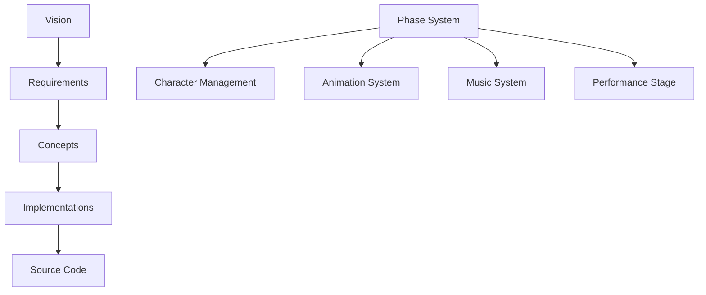

# Open Sprunk Framework Documentation

**A Phase-Centric Creative Game Framework**

Welcome to the Open Sprunk Framework documentation. This framework provides a comprehensive architecture for building creative games where every character has multiple "phases" combining appearance, animation, and music into seamless tri-modal experiences.

## 🎯 Project Status

**Architecture: COMPLETE ✅**  
**Implementation: READY TO BEGIN**

## 📖 Documentation Structure

This documentation follows a strata-based MDMD (Membrane Design MarkDown) approach with recursive bilayers. MDMD organizes specifications into semantic strata that represent different levels of abstraction, where each stratum contains its own bilayer of compositions (overviews) and units (specific details):

### [🌟 Definition/Vision/](./Definition/Vision/)
High-level vision, goals, and originating concepts for the framework.

### [📋 Definition/Requirements/](./Definition/Requirements/) 
Specific functional and technical requirements derived from the vision phase.

### [🏗️ Specification/Concepts/](./Specification/Concepts/)
Architectural designs, module breakdowns, and system compositions that fulfill requirements.

### [⚙️ Specification/Implementations/](./Specification/Implementations/)
Detailed specifications for individual classes, schemas, and implementable components with `source-ref` links to actual code.

**Navigation Tip**: MDMD documents use `[[id]]` cross-references to link related concepts. Look for these links throughout the documentation to trace relationships between vision, requirements, designs, and implementations.

## 🚀 Key Innovations

### **Phase-Centric Architecture**
- **Tri-Modal Units**: Every phase combines visual + kinetic + sonic elements
- **Character Wrappers**: Characters span multiple phases but phases are foundational
- **Configurable Transitions**: Player-controlled phase behaviors (hard vs natural)

### **Advanced Creative Tools**
- **Multi-Modal Audio**: Synthesis, recording, samples, and hybrid approaches
- **Direct Manipulation Animation**: "Click and drag a doll" interface for humanoid characters
- **Beat-Synchronized Everything**: Musical timing drives visual and kinetic coordination

### **Performance Innovation**
- **Natural Transitions**: Smooth phase changes with animation bridging (beyond typical Sprunki)
- **Multi-Entity Coordination**: Background, characters, and audio all participate in phases
- **Template-Based Creation**: Rapid content generation with smart defaults

## 📊 Architecture Overview

## 🛠️ Implementation Readiness

### Core Systems Specified
- ✅ **Phase Management**: Complete lifecycle and coordination
- ✅ **Character System**: Phase-aware character definitions
- ✅ **Animation System**: Humanoid body-part based with direct manipulation
- ✅ **Music System**: Multi-modal audio with beat synchronization
- ✅ **Performance System**: Live coordination with configurable transitions

### Editor Suite Specified  
- ✅ **Character Editor**: Multi-modal phase authoring
- ✅ **Animation Editor**: Beat-synchronized movement creation
- ✅ **Music Editor**: Loop-based composition with phase awareness
- ✅ **Performance Stage**: Live multi-entity coordination

### Data Architecture Specified
- ✅ **Phase Data Store**: Persistent tri-modal phase storage
- ✅ **Character Schema**: Phase-aware character definitions
- ✅ **Project Schema**: Complete game project structure
- ✅ **Timeline Schema**: Beat-aligned event coordination

## 📖 Complete Specification

For the full technical specification, see: [SpunkiGameSpec.mdmd.md](./SpunkiGameSpec.mdmd.md)

## 🎨 Creative Vision

The Open Sprunk Framework enables creators to build rich, interactive musical experiences where:

- **Every character has multiple "phases"** - different appearances, animations, and sounds
- **Phases transition smoothly** - natural animation bridging and audio crossfading
- **Everything is beat-synchronized** - visual, kinetic, and sonic elements align to musical timing
- **Creation is intuitive** - direct manipulation interfaces and smart suggestion systems
- **Performance is dynamic** - real-time coordination across multiple entities

## 🏃‍♂️ Getting Started

1. **Explore the Architecture**: Start with [Specification/Concepts/](./Specification/Concepts/) for system overview
2. **Understand the Vision**: Read [Definition/Vision/](./Definition/Vision/) for project goals
3. **Review Requirements**: Check [Definition/Requirements/](./Definition/Requirements/) for functional needs
4. **Dive into Implementation**: Browse [Specification/Implementations/](./Specification/Implementations/) for detailed specifications

---

*Documentation generated using MDMD (Membrane Design MarkDown) specification.*
