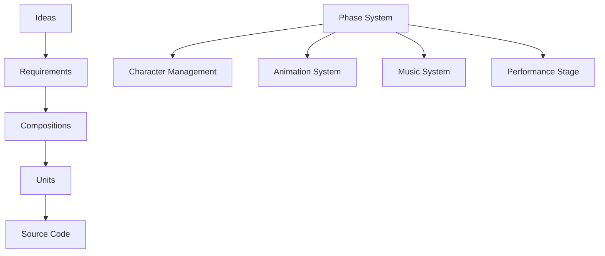

# Open Sprunk Framework Documentation

**A Phase-Centric Creative Game Framework**

Welcome to the Open Sprunk Framework documentation. This framework provides a comprehensive architecture for building creative games where every character has multiple "phases" combining appearance, animation, and music into seamless tri-modal experiences.

## 🎯 Project Status

**Architecture: COMPLETE ✅**  
**Implementation: READY TO BEGIN**

## 📖 Documentation Structure

This documentation follows a layered MDMD (Membrane Design MarkDown) approach:

### [🔭 00_IDEATION/](./00_IDEATION/)
High-level vision, goals, and originating concepts for the framework.

### [📋 01_REQUIREMENTS/](./01_REQUIREMENTS/) 
Specific functional and technical requirements derived from the ideation phase.

### [🏗️ 02_COMPOSITIONS/](./02_COMPOSITIONS/)
Architectural designs, module breakdowns, and system compositions that fulfill requirements.

### [⚙️ 03_UNITS/](./03_UNITS/)
Detailed specifications for individual classes, schemas, and implementable components.

## 🚀 Key Innovations

### **Phase-Centric Architecture**
- **Tri-Modal Units**: Every phase combines visual + kinetic + sonic elements
- **Character Wrappers**: Characters span multiple phases but phases are foundational
- **Configurable Transitions**: Player-controlled phase behaviors (hard vs natural)

### **Advanced Creative Tools**
- **Multi-Modal Audio**: Synthesis, recording, samples, and hybrid approaches
- **Direct Manipulation Animation**: "Click and drag a doll" interface for humanoid characters
- **Beat-Synchronized Everything**: Musical timing drives visual and kinetic coordination

### **Performance Innovation**
- **Natural Transitions**: Smooth phase changes with animation bridging (beyond typical Sprunki)
- **Multi-Entity Coordination**: Background, characters, and audio all participate in phases
- **Template-Based Creation**: Rapid content generation with smart defaults

## 📊 Architecture Overview

## 🛠️ Implementation Readiness

### Core Systems Specified
- ✅ **Phase Management**: Complete lifecycle and coordination
- ✅ **Character System**: Phase-aware character definitions
- ✅ **Animation System**: Humanoid body-part based with direct manipulation
- ✅ **Music System**: Multi-modal audio with beat synchronization
- ✅ **Performance System**: Live coordination with configurable transitions

### Editor Suite Specified  
- ✅ **Character Editor**: Multi-modal phase authoring
- ✅ **Animation Editor**: Beat-synchronized movement creation
- ✅ **Music Editor**: Loop-based composition with phase awareness
- ✅ **Performance Stage**: Live multi-entity coordination

### Data Architecture Specified
- ✅ **Phase Data Store**: Persistent tri-modal phase storage
- ✅ **Character Schema**: Phase-aware character definitions
- ✅ **Project Schema**: Complete game project structure
- ✅ **Timeline Schema**: Beat-aligned event coordination

## 📖 Complete Specification

For the full technical specification, see: [SpunkiGameSpec.mdmd.md](./SpunkiGameSpec.mdmd.md)

## 🎨 Creative Vision

The Open Sprunk Framework enables creators to build rich, interactive musical experiences where:

- **Every character has multiple "phases"** - different appearances, animations, and sounds
- **Phases transition smoothly** - natural animation bridging and audio crossfading
- **Everything is beat-synchronized** - visual, kinetic, and sonic elements align to musical timing
- **Creation is intuitive** - direct manipulation interfaces and smart suggestion systems
- **Performance is dynamic** - real-time coordination across multiple entities

## 🏃‍♂️ Getting Started

1. **Explore the Architecture**: Start with [02_COMPOSITIONS/](./02_COMPOSITIONS/) for system overview
2. **Understand the Vision**: Read [00_IDEATION/](./00_IDEATION/) for project goals
3. **Review Requirements**: Check [01_REQUIREMENTS/](./01_REQUIREMENTS/) for functional needs
4. **Dive into Implementation**: Browse [03_UNITS/](./03_UNITS/) for detailed specifications

---

*Documentation generated using MDMD (Membrane Design MarkDown) specification.*
